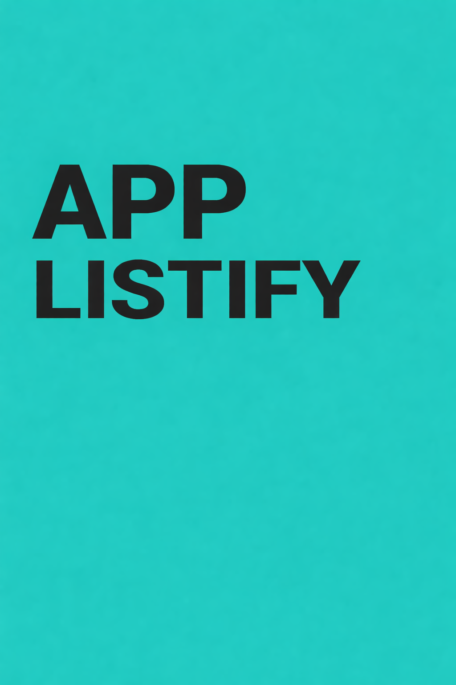

# 📝 ListiFy Web

O ListiFy Web é uma aplicação web desenvolvida em Angular com foco na criação e gerenciamento de coleções, como CDs, DVDs e outros itens colecionáveis. A plataforma permite que o usuário organize seu acervo de forma prática, mantendo controle sobre seus itens e facilitando a visualização e gestão das coleções.

[](https://angular.io/)
[](https://www.typescriptlang.org/)

## Back-end da aplicação

Back: https://github.com/Felipe-Amorim-Dev/ListiFy.Api

---

## 📌 Sobre o Projeto

O **ListiFy Web** é uma aplicação front-end desenvolvida em Angular com foco em organização de tarefas e gerenciamento de listas.

A aplicação permite que usuários criem, visualizem e gerenciem itens de forma simples, rápida e eficiente.

---

## 🎯 Objetivo

O objetivo do projeto é fornecer uma interface moderna e intuitiva para gerenciamento de listas, aplicando boas práticas de desenvolvimento front-end.

---

## 🛠️ Tecnologias Utilizadas

[](https://angular.io/)
[](https://www.typescriptlang.org/)
[](https://tailwindcss.com/)
[](https://developer.mozilla.org/pt-BR/docs/Web/HTML)
[](https://developer.mozilla.org/pt-BR/docs/Web/CSS)
[]()

---

## 📂 Estrutura do Projeto

```bash
src/
 ├── app/
 │   ├── components/
 │   ├── services/
 │   ├── guards/
 │   └── pages/
 ├── environments/
 └── assets/
 ```

## ▶️ Como Executar o Projeto

### 🔧 Pré-requisitos
```
Node.js instalado
Angular CLI instalado
npm install -g @angular/cli
```

### 🚀 Rodando o projeto

```
npm install
ng serve
```

**Acesse no navegador:**

http://localhost:4200/

## 🏗️ Build do Projeto

```
ng build
```

**Os arquivos serão gerados na pasta:**

dist/

## 🔐 Observações

Este repositório contém apenas o front-end da aplicação.

## 📄 Licença

**Este projeto está sob a licença MIT.**

## 👨‍💻 Autor

Desenvolvido por Felipe Amorim

GitHub: https://github.com/Felipe-Amorim-Dev

LinkedIn: https://www.linkedin.com/in/felipe-amorim-dev/
